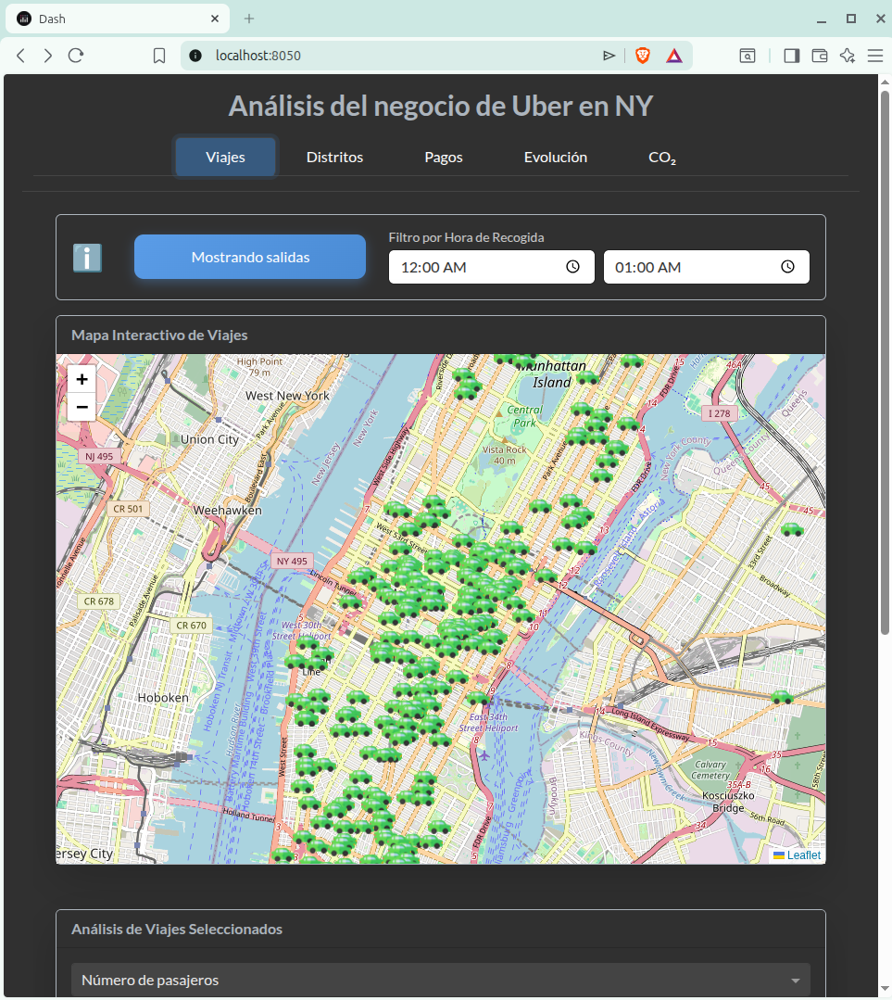
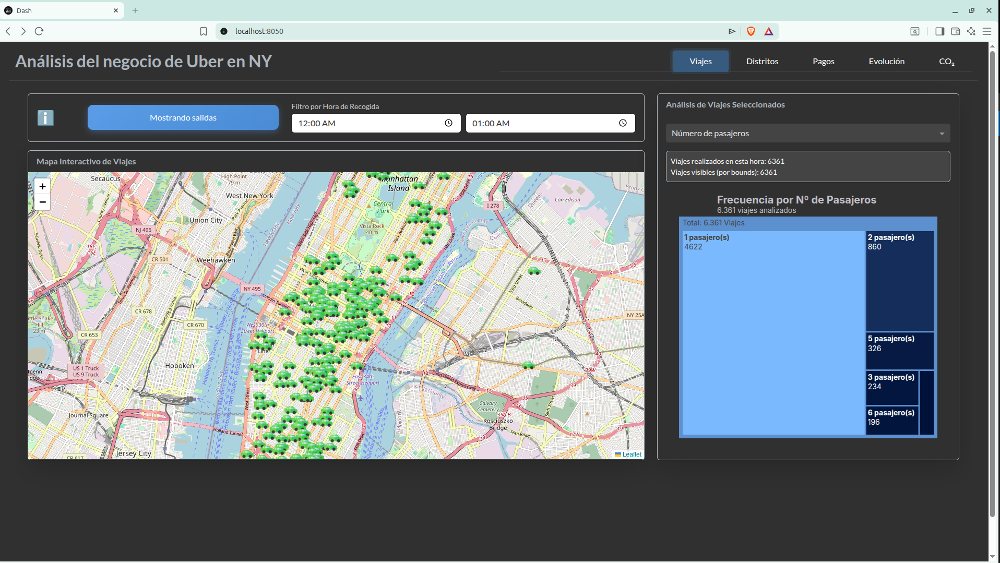
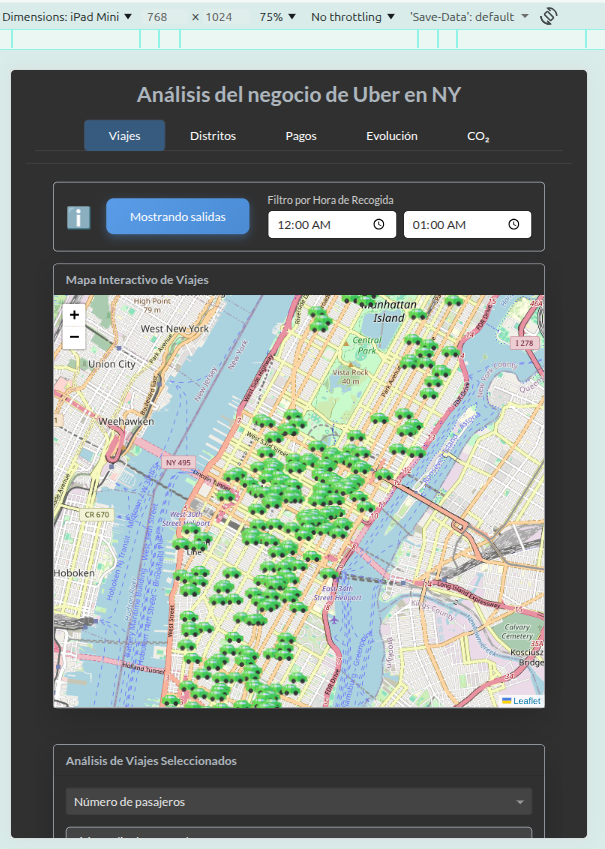

<a id="readme-top"></a>
<div align="center">
  <h1 align="center">🚕 Uber Data Dashboard: Comprendiendo el negocio de Uber en NY</h1>

  [](https://www.python.org/)
  [](https://www.docker.com/)
  [](LICENSE)
  
  <p align="center">
    Visualización interactiva de trayectorias, análisis económico y cálculo de impacto ambiental de viajes de Uber en Nueva York.
    <br />
    <br />
    <a href="#ejecución">Ejecución</a> •
    <a href="#características">Características</a> •
    <a href="#organizacion_codigo">Organizacion del código</a> •
    <a href="#análisis">Análisis del Dashboard</a> •
    <a href="#procesamiento">Procesamiento de Datos</a> •
    <a href="#emisiones">Cálculo de CO₂</a>
  </p>
</div>

---

<a id="ejecución"></a>
## 🐳 Ejecutar la aplicación

Sigue estos comandos para construir y desplegar el contenedor de la aplicación:

```bash
# Construir la imagen localmente
docker build -t dash-app .

# Iniciar el contenedor
docker run -p 8050:8050 dash-app
```

> [!IMPORTANT]
> Una vez iniciado el contenedor, accede a la aplicación a través de **[http://localhost:8050](http://localhost:8050)** (omite la dirección que pueda mostrar la terminal interna de Docker).

<p align="right">(<a href="#readme-top">Volver arriba</a>)</p>

---

<a id="características"></a>
## 🌐 Características Web

El dashboard ha sido diseñado bajo una arquitectura **Responsive Design**, garantizando una experiencia óptima en cualquier dispositivo:

* **Adaptabilidad Total:** Interfaz optimizada para smartphones, tablets y monitores de escritorio con diversas relaciones de aspecto.
* **Visualización Fluida:** Los elementos gráficos se reordenan automáticamente para evitar solapamientos o cortes en los títulos.

<div align="center">
  <p><em>Vistas en diferentes dispositivos (PC, media pantalla e iPad)</em></p>
  
  
  
</div>

<p align="right">(<a href="#readme-top">Volver arriba</a>)</p>

---

<a id="análisis"></a>
## 🖥️ Análisis del Dashboard

La siguiente sección describe cómo interactuar con el dashboard y explica las funcionalidades disponibles en cada una de sus vistas.  
La aplicación está dividida en módulos que permiten analizar distintas dimensiones del negocio de Uber en la ciudad de Nueva York.

---

### 🚗 Sección de Viajes

Vista principal orientada a la exploración detallada de los trayectos individuales y agrupados.

* **Ayuda integrada:**  
  Debido a la complejidad de esta vista, se incluye un botón de información (ℹ️) que ofrece instrucciones rápidas sobre cómo interactuar con el mapa y los gráficos.

* **Mapa de trayectorias interactivo:**
  * **Modo salidas / llegadas:**  
    Botón que permite alternar entre los puntos de recogida del pasajero (**salidas**) y los puntos de destino (**llegadas**).
  * **Filtro temporal:**  
    Selector dinámico de hora de inicio y hora de fin. Tanto el mapa como los gráficos laterales se actualizan automáticamente para mostrar únicamente los viajes iniciados en el rango seleccionado.
  * **Interacción con vehículos:**  
    * Al hacer clic sobre un icono de coche, el mapa se filtra para mostrar únicamente ese trayecto (salida y llegada).
    * El zoom se ajusta automáticamente para encuadrar ambos puntos.
    * Un segundo clic sobre el vehículo despliega información detallada del viaje: número de pasajeros, ingresos totales, duración y distancia.
    * Para volver a visualizar todos los viajes, basta con pulsar nuevamente el botón de salidas/llegadas.

* **Gráficos dinámicos (Plots):**  
  El tercio derecho de la vista reacciona en tiempo real a cualquier interacción en el mapa (zoom, desplazamiento, cambio de hora, etc.).
  * **Treemap:** Distribución de los viajes según el número de pasajeros.
  * **Violin plots:** Distribución del tiempo y la distancia de los viajes visibles en pantalla.  
  Estos gráficos permiten analizar tanto la frecuencia como la dispersión de los trayectos seleccionados.


### 🏢 Análisis por Distritos

Sección enfocada en la movilidad interurbana y en los desplazamientos dentro y entre distritos.

* **Heatmaps de tiempo y distancia:**  
  Muestran la media de tiempo y distancia de los viajes entre cada par de distritos.  
  Los valores más altos se representan con colores más intensos, facilitando la identificación de trayectos largos o lentos.

* **Doble Radial Map:**  
  Visualización comparativa de las conexiones de cada distrito con el resto:
  * Un plot radial representa la **distancia media**.
  * El otro muestra el **tiempo medio de viaje**.  
  Al pasar el cursor por cada conexión, se resalta el valor específico del trayecto, permitiendo detectar desequilibrios o flujos dominantes.


### 💳 Ventana de Pagos y Flujo Económico

Esta sección permite explorar los métodos de pago y el movimiento económico generado por los viajes.

* **Waffle Plot:**  
  Distribución de los tipos de pago, segmentada en cuatro rangos de precio.  
  Al pasar el cursor, se muestra el porcentaje que representa cada método dentro de su rango correspondiente.

* **Sankey Diagram:**  
  Representación visual del flujo de dinero desde las fuentes de ingreso (tarifa base, propinas y extras) hasta las categorías finales (total, recargos y peajes).  
  El hover sobre nodos o enlaces muestra el monto exacto asociado a cada flujo.


### 📈 Evolución del Negocio

Panel temporal que permite monitorizar la evolución del servicio hora a hora mediante una tabla resumen con los siguientes indicadores:

* Número total de pasajeros.
* Ingresos totales.
* Minutos acumulados de viaje.
* Distancia total recorrida.

Estos datos facilitan la identificación de picos de demanda y periodos de mayor actividad operativa.


### 🌿 Emisiones de CO₂

Sección dedicada al análisis del impacto ambiental de los viajes de Uber en la ciudad.

* **Tabla de emisiones totales por hora:**  
  Muestra los kilogramos totales de CO₂ emitidos en cada franja horaria.  
  Al hacer hover, se visualiza el valor exacto de emisiones para esa hora.

* **Análisis geográfico de emisiones:**  
  Gráfico que desglosa el CO₂ emitido por distrito de origen.
  * Permite filtrar por rango horario y distrito de salida.
  * Incluye la opción de alternar entre **emisiones totales por viaje** y **emisiones por pasajero**, facilitando un análisis más preciso del impacto ambiental.

<p align="right">(<a href="#readme-top">Volver arriba</a>)</p>

---
<a id="organizacion_codigo"></a>
## 👨‍💻 Código modular

La aplicación se ha estructurado siguiendo un **enfoque modular**, lo que permite una separación clara de responsabilidades entre los diferentes componentes del sistema. A continuación, se detalla cómo se ha organizado el código, las ventajas de esta estructura y las estrategias empleadas para evitar la duplicidad de lógica.

### 1. Organización del Proyecto

El código se divide en archivos especializados, lo que facilita la navegación y el mantenimiento:

*   **dashboard.py (app.py):** Actúa como el punto de entrada principal. Se encarga de inicializar la aplicación Dash, configurar el tema visual y orquestar la unión del layout y los callbacks.
*   **data.py:** Centraliza la carga de datos de "uber_dataset_con_distritos.csv", el pre-procesamiento de fechas y la definición de activos como iconos del mapa.
*   **layout.py:** Contiene la definición de la interfaz de usuario (UI), estructurada mediante pestañas (viajes, distritos, pagos, etc.) y componentes de Dash Bootstrap. Es el esqueleto de la aplicación.
*   **callbacks.py:** Gestiona toda la interactividad. Aquí se procesan los filtros de tiempo, el movimiento del mapa y la actualización de los gráficos en función de la entrada del usuario.
*   **my_plots.py:** Es la librería interna de visualización. Contiene las funciones que generan cada gráfico de Plotly, así como las configuraciones estéticas globales.

### 2. Beneficios de esta Organización

*   **Mantenibilidad:** Si hay un error en la lógica de un gráfico, se sabe que el problema reside en *my_plots.py*. Si el error es visual, se revisa *layout.py*.
*   **Escalabilidad:** Añadir una nueva pestaña o un nuevo análisis es tan sencillo como crear el contenido en el layout y registrar sus respectivos callbacks sin saturar el archivo principal.
*   **Claridad:** El flujo de datos es unidireccional y predecible, facilitando que otros desarrolladores entiendan el código rápidamente.

### 3. Estrategias para Evitar la Repetición de Código (DRY)

Para mantener el código limpio y eficiente, se han implementado varias técnicas que evitan la redundancia:

* **Declaración Centralizada de Estilos y Colores**
En lugar de definir los colores en cada gráfico, se declaran una sola vez en *my_plots.py* como constantes globales. Esto permite que, si se desea cambiar la paleta de la aplicación, solo sea necesario modificar un lugar:

```python
# Colores globales definidos en my_plots.py
CONTRAST_COLOR = "#5a9ce7"
TEXT_COLOR = "#c0c0c8"
CONTRAST_COLOR_2 = "#0d498d"
```

* **Uso de Plantillas Globales para Gráficos**
Se ha definido un diccionario llamado *plotly_style* que encapsula toda la configuración visual común (fuentes, márgenes, fondos transparentes y cuadrículas). Este estilo se aplica a todos los gráficos mediante el desempaquetado de diccionarios (***plotly_style*):

```python
# Estilo Plotly minimalista y reutilizable
plotly_style = {
    "template": "plotly_dark",
    "paper_bgcolor": "rgba(0,0,0,0)",
    "font": {"color": TEXT_COLOR, "family": "Montserrat, ..."},
    "xaxis": {"showgrid": True, "showline": True},
    # ... otros estilos comunes
}

# Aplicación en una función de gráfico
fig.update_layout(**plotly_style)
```

* **Funciones de Estilización Auxiliares**
Para gráficos que comparten características similares, como los diagramas de violín en la pestaña de viajes, se utiliza una función de ayuda (*stylize_violin*) que aplica las etiquetas y decoraciones comunes, evitando repetir la lógica de anotaciones y trazas en cada función individual.

* **Componentes de UI Reutilizables**
En *layout.py*, se han creado funciones como *InfoIcon* y *render_tag* que permiten generar elementos de la interfaz de forma dinámica a partir de diccionarios, eliminando la necesidad de escribir manualmente bloques repetitivos de HTML para cada tooltip o etiqueta de información.

<p align="right">(<a href="#readme-top">Volver arriba</a>)</p>

---

<a id="procesamiento"></a>
## 🧩 Recolección y Procesamiento de Datos

El ciclo de vida del dato se detalla en el notebook `data_preprocessing.ipynb`, basado en el [dataset de Uber de praveenluppunda](https://github.com/praveenluppunda/uber-dataset).

### 📦 Limpieza y Transformación
1.  **Filtrado Geoespacial:** Eliminación de registros con coordenadas (0,0).
2.  **Spatial Join:** Asignación de coordenadas a distritos oficiales de NYC mediante GeoJSON.
3.  **Enriquecimiento Categórico:** Mapeo descriptivo para `RatecodeID` y `payment_type`.
4.  **Tratamiento de Outliers:** Limpieza estadística basada en el Rango Intercuartílico ($3 \times \text{IQR}$).

```python
 # --- PROCESAMIENTO GEOESPACIAL ---

def assign_borough_from_geometry(df: pd.DataFrame, lat_col: str, lon_col: str, output_col: str) -> pd.DataFrame:

    """

    Asigna el distrito (borough) a las coordenadas usando una unión espacial.

    """

    print(f"\n--- Iniciando asignación de distrito para {output_col} ---")

    nyc_boundaries_url = "https://data.cityofnewyork.us/resource/gthc-hcne.geojson"

    try:

        boroughs_gdf = gpd.read_file(nyc_boundaries_url)

        boroughs_gdf.rename(columns={'boroname': 'borough_name_geo'}, inplace=True)

        boroughs_gdf = boroughs_gdf.to_crs(epsg=4326)

    except Exception as e:

        print(f"Error al cargar límites de distritos: {e}")

        return df

    geometry = [Point(xy) for xy in zip(df[lon_col], df[lat_col])]

    points_gdf = gpd.GeoDataFrame(df, geometry=geometry, crs="EPSG:4326")

    join_result = gpd.sjoin(points_gdf, boroughs_gdf[['borough_name_geo', 'geometry']], how="left", predicate="within")

    df[output_col] = join_result['borough_name_geo'].reindex(df.index).fillna('Out of NYC/Unknown')

    return df

```

<p align="right">(<a href="#readme-top">Volver arriba</a>)</p>

---

<a id="emisiones"></a>
## 💨 Cálculo de Emisiones de CO₂

Las emisiones se estimaron con base en metodologías **EMEP/COPERT** y factores de conversión **DEFRA (UK)**.

### Resumen del cálculo

#### 1. Consumo de combustible dependiente de la velocidad

$$
C(V) = 81.1 - 1.014 \cdot V + 0.0068 \cdot V^2
$$

donde:

- \( C(V) \) es el consumo de combustible en gramos por kilómetro (g/km)  
- \( V \) es la velocidad media del viaje (km/h)

---

### 2. Conversión de consumo a litros por kilómetro

$$
L_{\text{km}} = \frac{C(V) / 1000}{\rho_{\text{gasolina}}}
$$

con:

$$
\rho_{\text{gasolina}} \approx 0.74 \,\text{kg/L}
$$

---

### 3. Conversión a emisiones de CO\(_2\)

$$
E_{\text{km}} = L_{\text{km}} \times 2.0844
$$

donde \( E_{\text{km}} \) representa las emisiones de CO\(_2\) en kg por kilómetro.

---

### 4. Emisiones totales y por pasajero

$$
E_{\text{viaje}} = E_{\text{km}} \times D
$$

$$
E_{\text{pasajero}} =
\frac{E_{\text{viaje}}}{\max\left(1, N_{\text{pasajeros}}\right)}
$$

donde:

- \( D \) es la distancia total del viaje (km)  
- \( N_{\text{pasajeros}} \) es el número de pasajeros  

**Codigo:**

```python
# --- ESTIMACIÓN DE CO2 ---

FUEL_DENSITY_KG_PER_L = 0.74
CO2_PER_LITRE_KG = 2.0844


def fuel_g_per_km_emep_petrol(V_kmh: float) -> float:
    if np.isnan(V_kmh) or V_kmh <= 0:
        return np.nan

    V = float(np.clip(V_kmh, 10.0, 130.0))
    return 81.1 - 1.014 * V + 0.0068 * V**2


def co2_per_km_from_speed(V_kmh: float) -> float:
    fuel_g_km = fuel_g_per_km_emep_petrol(V_kmh)
    if np.isnan(fuel_g_km):
        return np.nan

    fuel_kg_km = fuel_g_km / 1000.0
    fuel_l_km = fuel_kg_km / FUEL_DENSITY_KG_PER_L
    return fuel_l_km * CO2_PER_LITRE_KG


def estimate_co2_dataframe(
    df: pd.DataFrame,
    distance_col='trip_distance_km',
    minutes_col='trip_minutes',
    passengers_col='passenger_count'
):
    df = df.copy()

    df['avg_speed_kmh'] = df[distance_col] / (df[minutes_col] / 60.0)
    df['co2_kg_per_km'] = df['avg_speed_kmh'].apply(co2_per_km_from_speed)
    df['co2_kg_trip'] = df['co2_kg_per_km'] * df[distance_col]

    df['passenger_count_safe'] = (
        df[passengers_col].replace({0: 1}).fillna(1)
    )

    df['co2_kg_per_passenger'] = (
        df['co2_kg_trip'] / df['passenger_count_safe']
    )

    return df
```

---

## ⚒️ Transformaciones finales

Antes de la carga de datos al dashboard, se aplicaron las siguientes transformaciones adicionales:

- Conversión de categorías (`RatecodeID`, `payment_type`)
- Eliminación de columnas no necesarias
- Filtrado de outliers extremos
- Cálculo final de columnas derivadas:
  - `avg_speed_kmh`
  - `co2_kg_trip`
  - `co2_kg_per_passenger`

```python
# --- TRANSFORMACIONES FINALES ---

ratecode_map = {
    1: "Standard rate",
    2: "JFK",
    3: "Newark",
    4: "Nassau or Westchester",
    5: "Negotiated fare",
    6: "Group ride",
    99: "Null/unknown"
}

if 'RatecodeID' in df.columns:
    df['RatecodeID'] = df['RatecodeID'].map(ratecode_map)


payment_type_map = {
    0: "Flex Fare trip",
    1: "Credit card",
    2: "Cash",
    3: "No charge",
    4: "Dispute",
    5: "Unknown",
    6: "Voided trip"
}

if 'payment_type' in df.columns:
    df['payment_type'] = df['payment_type'].map(payment_type_map)


if 'store_and_fwd_flag' in df.columns:
    df = df.drop(columns=['store_and_fwd_flag'])


# Filtrado de outliers extremos
nrows = df.shape[0]

for col in ['trip_distance_km', 'trip_minutes']:
    Q1 = df[col].quantile(0.25)
    Q3 = df[col].quantile(0.75)
    IQR = Q3 - Q1

    lower_bound = Q1 - 3 * IQR
    upper_bound = Q3 + 3 * IQR

    df = df[(df[col] >= lower_bound) & (df[col] <= upper_bound)]

print(f"{nrows - df.shape[0]} filas eliminadas")
```


---

## 📚 Referencias
* **EMEP/COPERT:** Agencia Europea del Medio Ambiente.
* **DEFRA:** UK Department for Environment, Food and Rural Affairs.
* **NYC Open Data:** Borough Boundaries GeoJSON.

<p align="right">(<a href="#readme-top">Volver arriba</a>)</p>


## 🫂 Autores

<a href="https://github.com/aestoquera/visualizacion_datos.UberDashboard/graphs/contributors">
  
</a>

[Estoquera Núñez, Adrián](https://github.com/aestoquera)


<p align="right">(<a href="#readme-top">Volver arriba</a>)</p>

<a id="licencia"></a>
